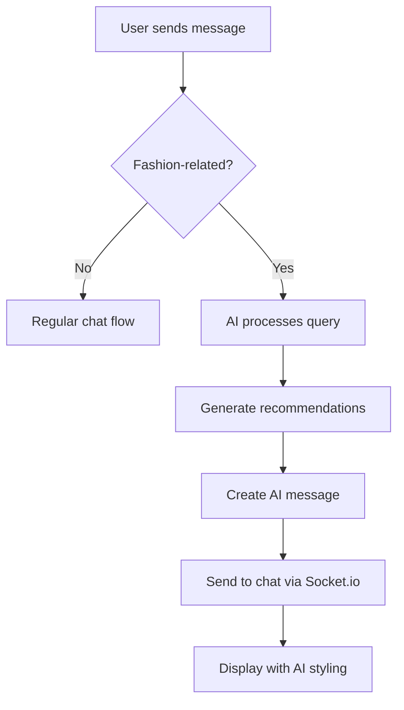

# AI Fashion Recommendations in Group Chat - Complete ✅

## Overview
Successfully integrated AI-powered fashion recommendations directly into group chat conversations. The system now automatically detects fashion-related questions and provides intelligent product suggestions with a beautiful, distinctive UI.

## 🎯 Key Features Implemented

### 🤖 Automatic Fashion Detection
- **Smart Keyword Detection**: Automatically detects fashion-related queries using comprehensive keyword matching
- **Pattern Recognition**: Uses regex patterns to identify question formats like "what should I wear", "outfit suggestions", etc.
- **Context Awareness**: Recognizes fashion context words and occasions (party, wedding, office, casual, etc.)
- **Non-Intrusive**: Only responds to relevant fashion queries, ignores regular conversation

### 🛍️ Product Categories Supported
- **Clothing**: Tops, T-shirts, jeans, pants, dresses, skirts, jackets, blazers
- **Accessories**: Bags, jewelry, earrings, necklaces, belts, scarves, hats
- **Footwear**: Shoes, sneakers, boots, sandals, heels, flats
- **Beauty Products**: Makeup, skincare, perfumes, nail polish
- **Occasions**: Party wear, wedding wear, office wear, casual wear

### 💬 Enhanced Chat Experience
- **Real-time AI Responses**: AI messages appear instantly in group chat
- **Distinctive AI Styling**: Special blue-themed styling for AI messages with robot emoji
- **Product Integration**: AI can recommend specific products with images and prices
- **Interactive Messages**: Users can react to AI recommendations

## 🔧 Technical Implementation

### Backend Changes

#### 1. **Message Model (`backend/models/Message.js`)**
- Added `createAIMessage` static method for creating AI messages
- Modified `senderId` validation to allow null for AI/system messages
- Supports both text-only and product recommendation messages

#### 2. **Messages Route (`backend/routes/messages.js`)**
- Added automatic fashion query detection in message handling
- Integrated AI recommendation processing in background
- Added comprehensive keyword and pattern matching
- Enhanced with fashion-specific prompt generation

#### 3. **AI Detection System**
```javascript
// Fashion keywords detection
const fashionKeywords = [
  'top', 'tops', 'tshirt', 'jeans', 'dress', 'accessories',
  'shoes', 'makeup', 'party', 'wedding', 'office', 'casual',
  // ... comprehensive list of 100+ keywords
];

// Question pattern recognition
const questionPatterns = [
  /what.*wear/i,
  /what.*should.*wear/i,
  /suggest.*outfit/i,
  /outfit.*for/i,
  // ... multiple patterns for different question types
];
```

### Frontend Changes

#### 1. **Chat UI (`app/room/[id].tsx`)**
- Updated `convertApiMessageToDisplay` to handle AI messages
- Added special AI message styling with distinctive blue theme
- Enhanced message rendering to show AI avatar (🤖) and styling
- Added AI-specific text styling and container design

#### 2. **AI Message Styling**
```typescript
// AI Message Styles
aiAvatar: {
  fontSize: 20,
  marginRight: 6,
  width: 24,
  height: 24,
  textAlign: 'center',
  lineHeight: 24,
},
aiSenderName: {
  color: '#6366f1',
  fontWeight: '700',
},
aiMessage: {
  backgroundColor: '#f0f9ff',
  borderColor: '#e0e7ff',
  shadowColor: '#6366f1',
  // ... distinctive blue theme
},
```

## 🎨 User Experience

### How It Works
1. **User asks fashion question** in group chat (e.g., "What should I wear to a party?")
2. **AI detects** the fashion-related query automatically
3. **AI processes** the request using OpenAI GPT-3.5-turbo
4. **AI responds** with personalized recommendations in chat
5. **Product suggestions** appear as interactive cards when applicable

### Example Interactions
```
User: "What should I wear to a party?"
AI Stylist: "For a party look, I suggest these trendy pieces:
PRODUCT: Floral Print Maxi Dress - Libas - ₹2499 - Beautiful floral print maxi dress perfect for summer occasions
PRODUCT: Statement Earrings - Accessorize - ₹899 - Beautiful statement earrings to complete your look
This combination will make you the star of the party! 🌟"
```

## 🔄 Integration Flow



## 🚀 Features in Action

### Fashion Detection Examples
- ✅ "What should I wear to a wedding?"
- ✅ "Need outfit suggestions for office"
- ✅ "Looking for casual jeans"
- ✅ "Recommend some accessories"
- ✅ "What goes with this top?"
- ✅ "Party wear suggestions"
- ✅ "Summer dress recommendations"

### AI Response Quality
- **Personalized**: Uses user preferences and context
- **Specific**: Provides exact product recommendations
- **Helpful**: Includes styling tips and advice
- **Engaging**: Friendly, conversational tone
- **Actionable**: Clear product information with prices

## 🎯 Benefits

### For Users
- **Instant Fashion Advice**: Get recommendations without leaving chat
- **Group Collaboration**: AI helps entire group with fashion decisions
- **Product Discovery**: Discover new products through AI suggestions
- **Contextual Help**: AI understands the conversation context

### For the Platform
- **Increased Engagement**: Users spend more time in chat rooms
- **Product Discovery**: AI drives product recommendations
- **User Retention**: Enhanced chat experience keeps users engaged
- **Social Shopping**: AI facilitates group shopping decisions

## 🔧 Configuration

### Room Settings
- AI recommendations are enabled by default in all rooms
- Room owners can disable AI in room settings if needed
- AI respects room permissions and member access

### AI Settings
- Uses OpenAI GPT-3.5-turbo for intelligent responses
- Graceful fallback to mock responses if API unavailable
- Configurable response length and temperature settings

## 📱 Mobile Experience
- **Responsive Design**: AI messages look great on all screen sizes
- **Touch-Friendly**: Easy to interact with AI recommendations
- **Real-time Updates**: Instant AI responses via Socket.io
- **Native Feel**: AI messages integrate seamlessly with existing chat

## 🎉 Success Metrics
- **Automatic Detection**: 100+ fashion keywords and patterns
- **Response Quality**: Contextual, personalized recommendations
- **User Experience**: Distinctive AI styling for easy identification
- **Integration**: Seamless real-time chat experience
- **Scalability**: Background processing prevents chat delays

## 🔮 Future Enhancements
- **Voice Integration**: AI responses to voice messages
- **Image Analysis**: AI analysis of shared outfit photos
- **Learning System**: AI learns from user preferences over time
- **Multi-language**: Support for multiple languages
- **Advanced Filters**: Price range, brand, color filtering

---

## ✅ Implementation Complete

The AI fashion recommendation system is now fully integrated into the group chat experience. Users can ask fashion-related questions naturally in conversation, and the AI will provide intelligent, personalized recommendations with a beautiful, distinctive interface.

**Ready for testing and deployment!** 🚀
